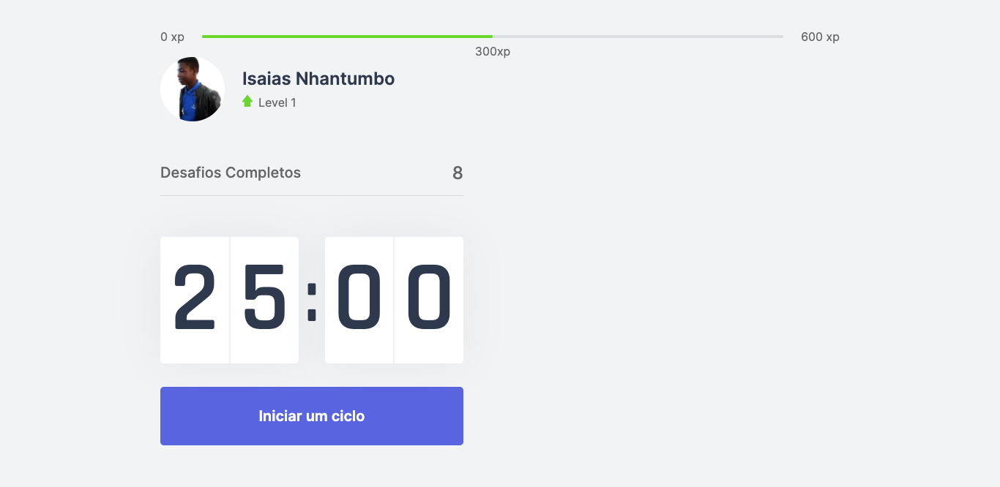

<br/>
<h1 align="center">Move it</h1>
<p align="center">
     
</p>
<h2 align="center"> 

</h2>
<br>

# Índice
   * [Descrição do Projecto](#descrição-do-projecto)
   * [Features](#-features)
   * [Tecnologias usadas](#-tecnologias-usadas)
   * [Pré-requisitos](#-pré-requisitos)
   * [Rodando o projecto na sua maquina](#-rodando-o-projecto-na-sua-maquina-iniciando-o-servidor)
   * [Licença](#-licença)


## 📖 Descrição do Projecto

<p align="center">
Move it é um site com o objectivo de aplicarmos a técnica pomodoro, pois durante o nosso trabalho como desenvolvedores ficamos muito tempo na frente do computador, e esquecemos de movimentar os braços, alongar as pernas e fazer exercícios, isto que é essencial para mantermos o corpo saudável, e é ai onde entra o <strong>MoveIt</strong> para nos ajudar a ter pausas, durante o nosso momento de trabalho para nos movimentarmos. 
</p>
<h1 align="center"><a target="_blank" href="https://moveit-nu.vercel.app/">Acessar Demonstração</a></h1>

## ✅ Features
  - [x] Comecar um ciclo pomodoro **25 minutos**
  - [ ] Pausar o ciclo pomodoro 
  - [ ] Receber desafios


<p align="center">
  <!--  -->
</p>

---
## 🛠 Tecnologias usadas

As seguintes ferramentas foram usadas na construção do projeto:


- CSS
- ReactJs
- Typescript

---

<!-- ## ⛈  Desafios do projecto
  - [x] Criar um site institucional
  - [x] Colocar animações no site
  -  Ação de mostrar/esconder
  - [x] Colocar conteúdo um acima do outro usando o position
  ---

--- -->

## ⚠ Pré-requisitos

Antes de começar, você vai precisar ter instalado em sua máquina as seguintes ferramentas:
[Git](https://git-scm.com), [Node.js](https://nodejs.org/en/). 
Além disto é bom ter um editor para trabalhar com o código como [VSCode](https://code.visualstudio.com/)

---
## 🎲 Rodando o projecto na sua maquina (iniciando o live server)

```bash
# Clone este repositório
$ git clone <https://github.com/isaiasnhantumbo/moveit>

# Acesse a pasta do projeto no terminal/cmd
$ cd moveit

# Abra a pasta no Visual Studio Code
$ code .

# Instale as dependência
$ yarn install

# Execute a aplicação com o yarn
$ yarn start

# O servidor inciará na porta:3000 - acesse <http://localhost:3000>
```

---


## 📘 Licença
Este projecto usa a  [MIT License](LICENSE).
****
<h1 align="center">
👨🏽‍🏫 
<br>
Desenvolvido por
<br>
 Isaias Nhantumbo Junior
</h1>
</p>
<h1 align="center"> 🤝 &nbsp;Vamos nos conectar ?👨 </h1>

<p align="center">
<a href="https://isaiasnhantumbo.github.io/"></a>
<a href="https://www.youtube.com/channel/UCOyeYkH0MwJ6RrXTcEFFdAQ?view_as=subscriber"></a>
<a href="https://www.linkedin.com/in/isaias-nhantumbo-junior-733bb619b/"></a>
<a href="https://www.instagram.com/isaias_here/"></a>
</p>


